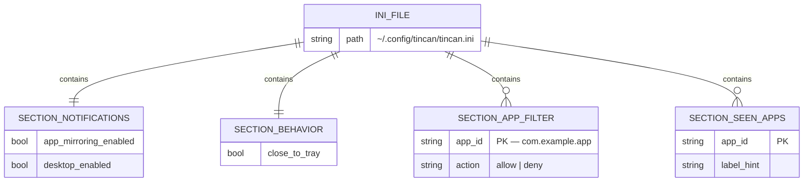
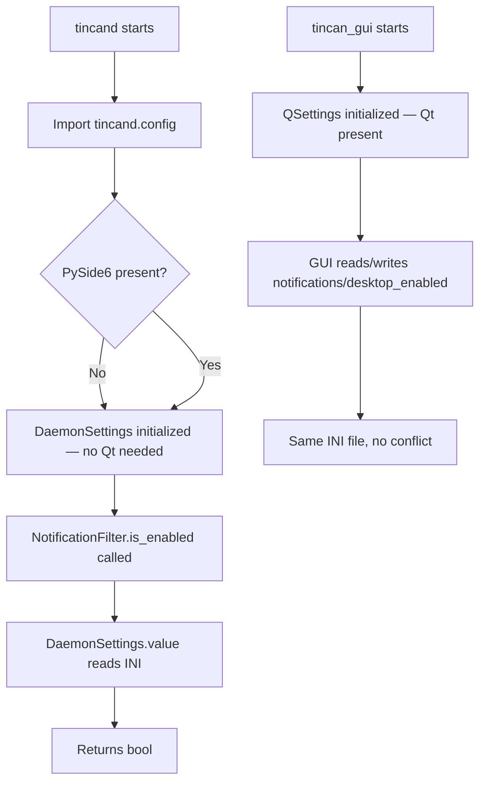
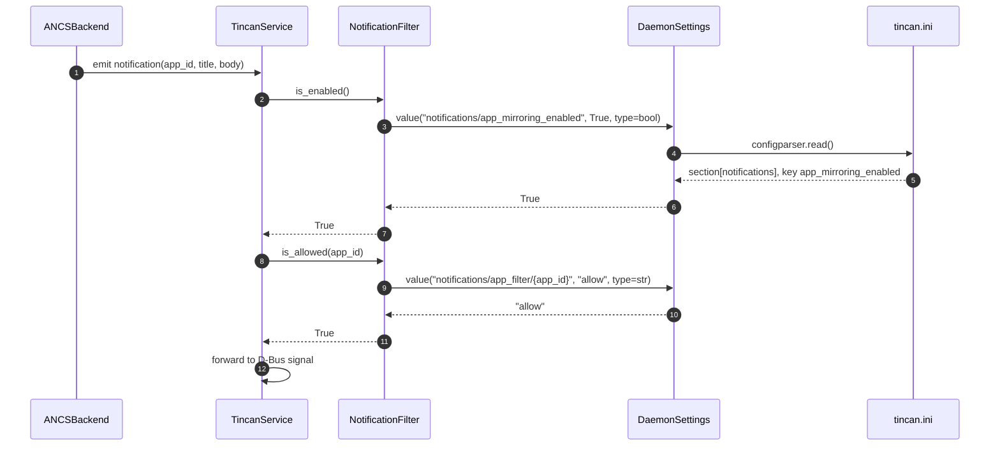
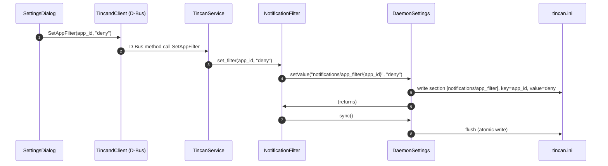

# Architecture: Decouple tincand from Qt/GUI (tincan-5ylqf)

## Problem Statement

`tincand/notification_filter.py` imports `from tincan_gui._settings import app_settings`,
which pulls in `PySide6.QtCore.QSettings`. Running the daemon without PySide6 installed
fails at import time with `ModuleNotFoundError: PySide6`. The daemon is supposed to be
headless; it must not depend on a GUI framework.

**Root locus:** `tincand/notification_filter.py:10` — one import line is the sole violation.

---

## Requirements

| ID | Requirement |
|----|-------------|
| FR-1 | `python -m tincand` runs without PySide6 installed |
| FR-2 | `NotificationFilter` and `SeenAppsRegistry` continue to persist settings to `~/.config/tincan/tincan.ini` |
| FR-3 | Settings written by the daemon are readable by the GUI and vice versa (shared INI file) |
| FR-4 | The daemon settings API supports the same operations used in `notification_filter.py` |
| NFR-1 | Zero changes to `tincan_gui/` |
| NFR-2 | Minimal blast radius — all changes confined to `tincand/` |
| NFR-3 | No new third-party package dependencies |
| NFR-4 | Backward compatible with existing `~/.config/tincan/tincan.ini` files written by QSettings |

---

## Constraints

| Type | Constraint |
|------|-----------|
| Technical | Python 3.10+; `configparser` and `pathlib` are stdlib |
| Technical | Must produce/consume INI files in QSettings-compatible format |
| Business | Must not break existing user config files |
| Scope | Only one file in `tincand/` currently violates the boundary |

---

## Selected Approach: `tincand/config.py` — Qt-free settings shim

Add one new file, change one import. No structural changes to packages or APIs.

### Framework/Library Selections

| Layer | Choice | Rationale |
|-------|--------|-----------|
| Config storage | Python `configparser` (stdlib) | Reads/writes INI natively; zero deps; format compatible with QSettings INI |
| File path | `platformdirs` or manual XDG fallback | QSettings resolves `("tincan","tincan")` to `~/.config/tincan/tincan.ini` on Linux |

### QSettings INI Format Mapping

QSettings on Linux with `("tincan","tincan")` stores at `~/.config/tincan/tincan.ini`.
The key path `"section/key"` is stored as INI section `[section]` with option `key`.
Nested paths `"section/sub/key"` use section `[section/sub]` with option `key`.

`configparser` uses the same model. Key-path splitting: everything up to the last `/` is
the section name; the final component is the option name.

Example mappings:

| QSettings key | INI section | INI option |
|--------------|-------------|-----------|
| `notifications/app_mirroring_enabled` | `[notifications]` | `app_mirroring_enabled` |
| `notifications/app_filter/com.apple.mobilephone` | `[notifications/app_filter]` | `com.apple.mobilephone` |
| `notifications/seen_apps/com.apple.mobilephone` | `[notifications/seen_apps]` | `com.apple.mobilephone` |

Shared INI file layout:

```ini
[notifications]
app_mirroring_enabled = true        ; daemon-owned
desktop_enabled = true              ; GUI-owned

[behavior]
close_to_tray = true                ; GUI-owned

[notifications/app_filter]
com.apple.mobilephone = deny        ; daemon-owned

[notifications/seen_apps]
com.apple.mobilephone = Messages    ; daemon-owned
```

---

## Data Model



---

## API Design

### `tincand/config.py` — Public Interface

```python
class DaemonSettings:
    """Qt-free settings backed by configparser INI.
    
    Implements the subset of QSettings used by notification_filter.py:
        value(key, default, type=None)
        setValue(key, value)
        sync()
        beginGroup(group)
        endGroup()
        childKeys()
    
    Key format: "section/option" or "section/sub/option".
    The last path component is the INI option; everything before it is the section.
    """

def app_settings() -> DaemonSettings:
    """Factory — returns DaemonSettings pointed at ~/.config/tincan/tincan.ini."""
```

### Type Coercion Rules

| `type=` arg | Input string | Output |
|-------------|-------------|--------|
| `bool` | `"true"`, `"1"`, `"yes"` | `True` |
| `bool` | `"false"`, `"0"`, `"no"` | `False` |
| `str` | any | passthrough |
| `int` | numeric string | `int(value)` |
| `None` | any | passthrough (str) |

Boolean serialization in `setValue`: always lowercase `"true"` / `"false"` to match QSettings output.

---

## Use Cases



---

## Sequence Diagrams

### Filter check on incoming ANCS notification



1. Backend fires notification with app_id and message content.
2. Service checks global mirroring toggle via `NotificationFilter.is_enabled()`.
3. `NotificationFilter` reads the config key via `DaemonSettings.value()`.
4. `DaemonSettings` reads the INI file via `configparser`.
5. INI returns the stored value for `[notifications] app_mirroring_enabled`.
6. Coerced to bool and returned to the filter.
7. Global toggle is on; proceed.
8. Service checks per-app filter via `is_allowed(app_id)`.
9. Filter reads per-app key from `[notifications/app_filter]`.
10. Key not present → default `"allow"` returned.
11. Filter returns True (allowed).
12. Service emits the D-Bus signal to connected GUI clients.

### User disables an app in Settings dialog



1. User clicks "Deny" for an app in the Settings dialog.
2. GUI calls the D-Bus method `SetAppFilter(app_id, "deny")` on the daemon.
3. Daemon dispatches to `TincanService.SetAppFilter`.
4. Service delegates to `NotificationFilter.set_filter(app_id, "deny")`.
5. Filter calls `DaemonSettings.setValue(...)` — section `[notifications/app_filter]`, key=app_id.
6. `DaemonSettings` writes to the in-memory config parser.
7. Filter calls `sync()` to flush.
8. `DaemonSettings` writes the INI file atomically (temp file + rename).

---

## Change Surface

| File | Action | Description |
|------|--------|-------------|
| `tincand/config.py` | CREATE | `DaemonSettings` class + `app_settings()` factory |
| `tincand/notification_filter.py:10` | CHANGE | Replace `from tincan_gui._settings import app_settings` → `from tincand.config import app_settings` |
| `tincan_gui/` | NONE | No changes |

---

## Security Controls

| Control | Detail |
|---------|--------|
| File permissions | `~/.config/tincan/tincan.ini` should be `0600` (user-only). `DaemonSettings` must create parent dirs with `0700` and file with `0600` on first write. |
| No secret storage | Settings keys are toggle booleans and allow/deny strings. No sensitive data stored. |
| Input validation | `set_filter` already validates `action in ("allow","deny")`. No new validation surface. |

---

## Risks

| Risk | Likelihood | Impact | Mitigation |
|------|-----------|--------|-----------|
| QSettings INI section naming differs from assumed format | Low | Medium | Builder must verify: run QSettings, read the raw INI, confirm section names match the split formula |
| Concurrent write race (daemon + GUI both writing) | Very Low | Low | Atomic write (temp + rename) in `DaemonSettings.sync()`; configparser re-reads on `value()` for freshness |
| Boolean encoding mismatch | Low | Low | Normalize all boolean writes to lowercase `"true"`/`"false"` |
| `configparser` lowercases option names by default | Low | Medium | QSettings is case-sensitive for option names; set `optionxform = str` on the parser to preserve case |

---

## Alternatives Considered

| Approach | Why Not Selected |
|----------|----------------|
| Shared `tincan.settings` package (3rd top-level package) | More architecturally pure but adds structural complexity; GUI would need to be updated to import from the new package. No benefit beyond eliminating one import violation today. Revisit if more shared logic emerges. |
| Lazy import guard in notification_filter.py (`try: from tincan_gui...`) | Fragile: import success depends on PySide6 presence, not Qt initialization. Hides the dependency rather than removing it. |
| Daemon reads settings via D-Bus from the GUI | Adds inter-process dependency; breaks headless operation when GUI is not running. |
| Move `_settings.py` to `tincand`, have GUI import from there | Flips the dependency (GUI depends on daemon package) — equally wrong. |

---

## Handoff Notes for Designer

The implementation scope is small and well-defined:

1. **`tincand/config.py`** — new file, ~80 lines:
   - `DaemonSettings` class wrapping `configparser.ConfigParser`
   - Path resolution: `Path.home() / ".config" / "tincan" / "tincan.ini"` (or `XDG_CONFIG_HOME`)
   - `optionxform = str` on the parser (preserve key case)
   - `_split_key(key)` helper: `rsplit("/", 1)` → `(section, option)`; if no `/`, use `"General"` section (QSettings default)
   - Atomic write in `sync()`: write to `.tmp` then `rename`
   - Group context stack: `list[str]` pushed/popped by `beginGroup`/`endGroup`; prepended to key in `value`/`setValue`/`childKeys`

2. **`tincand/notification_filter.py` line 10** — change one import.

3. **Tests**: unit-test `DaemonSettings` in isolation using a temp INI file; test `bool`, `str`, `int` type coercion; test `beginGroup`/`endGroup`/`childKeys` round-trip; test that values written match QSettings-expected INI format.
