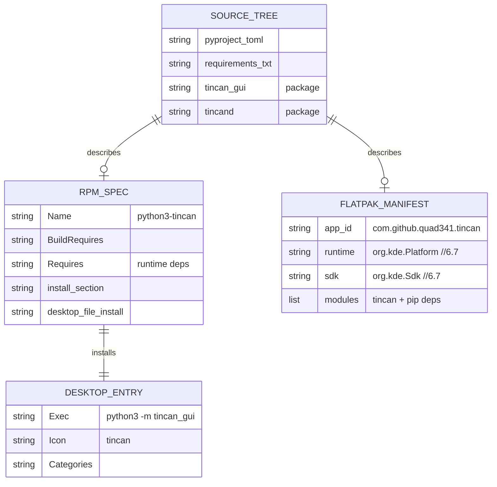
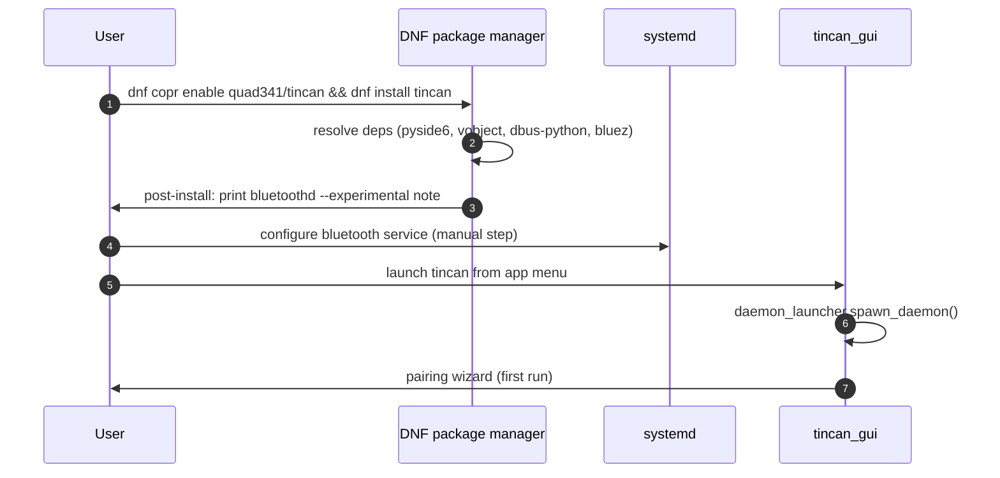

# Architecture: Packaging & Distribution (tincan-j9wvv)

## Requirements

| ID | Requirement |
|----|-------------|
| FR-1 | Users can install tincan on a modern Fedora/RHEL-based Linux desktop without building from source |
| FR-2 | Package bundles all Python dependencies or specifies them as RPM/Flatpak dependencies |
| FR-3 | Package includes a `.desktop` entry and application icon |
| FR-4 | Installation instructions document the `bluetoothd --experimental` requirement (needed for ANCS) |
| FR-5 | The headless daemon `tincand` can be run independently of the GUI |
| NFR-1 | Distribution format must be discoverable/installable by a normal desktop user |
| NFR-2 | Must not require a COPR build host for the initial release |

---

## Constraints

| Type | Constraint |
|------|-----------|
| Technical | Runtime dependencies: Python 3.10+, PySide6 ≥ 6.5, vobject ≥ 0.9, dbus-python, PyGObject (GLib), obexd, BlueZ ≥ 5.x |
| Technical | `bluetoothd --experimental` is required for ANCS (GATT server registration); **cannot be automated** by the package — requires a user-visible configuration step |
| Technical | oFono is not yet a dependency (HFP is roadmap, not current) |
| Business | Target platforms: Fedora 42+, possibly Ubuntu 22.04+ |
| Business | No Apple-ID, no proprietary agents — must be distributable without legal risk |

---

## Packaging Format Evaluation

| Format | Pros | Cons | Verdict |
|--------|------|------|---------|
| **Flatpak** | Self-contained, sandboxed, universal across distros; Flathub is the primary Linux app store | Bluetooth DBus access from sandbox requires D-Bus portals or `--socket=session-bus` (complex for tincand); PySide6 is available in KDE runtime | **Preferred for stable release** — but tincand's deep D-Bus/BlueZ usage requires careful portal wiring |
| **RPM (COPR)** | Native Fedora packaging; system-level deps resolved by DNF; tincand runs unsandboxed | Requires COPR account + spec file maintenance; separate Python dep RPMs needed if not in Fedora repos | **Best for Fedora/RHEL** — simpler D-Bus access than Flatpak |
| **AppImage** | Zero install, portable binary; runs anywhere glibc matches | Cannot bundle system BlueZ/obexd/dbus-python; app deps must be compiled in; complex to build | **Not recommended** — tincan is too integrated with system services |
| **pip / PyPI** | Zero packaging overhead initially | No `.desktop`, no system integration, requires user to set up virtualenv | **Dev/power-user only**, not a consumer install |

### Recommendation: RPM via COPR (Phase 1) + Flatpak (Phase 2)

**Phase 1:** RPM/COPR — fastest path to installable package with full system D-Bus access.
**Phase 2:** Flatpak — for Flathub distribution. Requires resolving the D-Bus sandbox issue.

---

## Framework Selections

| Layer | Choice | Rationale |
|-------|--------|-----------|
| Build backend | `pyproject.toml` (PEP 517, already present) | Standard; works with `flit`, `setuptools`, `hatchling` |
| RPM spec generator | `python-rpm-macros` + hand-written `.spec` | Standard Fedora approach for Python packages |
| Flatpak manifest | `org.flatpak.Builder` YAML manifest | Standard; integrates with GNOME Builder / CLI |
| Desktop entry | FreeDesktop `.desktop` spec | Required for app menu integration |
| Icon | SVG (scalable) + 256×256 PNG | `.desktop` spec requires raster fallback |

---

## Runtime Dependency Map

```
tincan_gui:
  python3 ≥ 3.10
  python3-pyside6 ≥ 6.5
  python3-dbus (dbus-python)
  python3-gobject (PyGObject — for GLib in dbus_client)

tincand:
  python3 ≥ 3.10
  python3-dbus
  python3-gobject (GLib.MainLoop, GLib.timeout_add)
  python3-vobject (vCard parsing for PBAP)
  bluez ≥ 5.x (system — bluetoothd, obexd)
  obexd (may be separate package from bluez on some distros)

System (must exist, not bundled):
  bluez-obexd
  dbus-broker or dbus-daemon (session bus)
  bluetoothd --experimental (for ANCS — NOT startable by the package)
```

---

## `.desktop` Entry Design

```ini
[Desktop Entry]
Type=Application
Name=Tincan
GenericName=Phone Companion
Comment=Send and receive iPhone messages from your Linux desktop
Exec=python3 -m tincan_gui
Icon=tincan
Categories=Network;Chat;
Keywords=iPhone;Bluetooth;SMS;Messages;
StartupWMClass=tincan_gui
```

The icon file (`tincan.svg` / `tincan.png`) should be placed in
`/usr/share/icons/hicolor/{scalable,256x256}/apps/tincan.{svg,png}`.

---

## `bluetoothd --experimental` Requirement

**Why required:** ANCS GATT server registration (`GattManager.RegisterApplication`)
is only available when `bluetoothd` runs with the `--experimental` flag. Without
it, the ANCS backend silently fails to advertise.

**Cannot be automated in the package** — the package cannot modify `bluetoothd`'s
startup flags; that's a user or sysadmin action.

**Documentation approach:**
- `README.md` — prominent callout under "Installation"
- Post-install script (RPM `%post` section) — print a message to terminal:
  ```
  tincan: ANCS notifications require bluetoothd --experimental.
  See /usr/share/doc/tincan/README.md for setup instructions.
  ```
- In-app: the capability degradation banner already fires when ANCS is unavailable;
  add a clickable link to the docs.

**Concrete steps for the user:**
```ini
# /etc/systemd/system/bluetooth.service.d/experimental.conf
[Service]
ExecStart=
ExecStart=/usr/lib/bluetooth/bluetoothd --experimental
```
Then `systemctl daemon-reload && systemctl restart bluetooth`.

---

## Data Model — Package Structure



---

## Sequence: Install and First Run (RPM)



1. User enables COPR and installs; DNF resolves all Python/system deps.
2. Post-install script prints the `bluetoothd --experimental` configuration note.
3. User must manually configure bluetoothd (cannot be automated).
4. After configuring, user launches tincan from GNOME/KDE app menu.
5. tincan_gui auto-starts tincand (existing daemon_launcher).
6. Pairing wizard guides first-time setup.

---

## Risks

| Risk | Likelihood | Impact | Mitigation |
|------|-----------|--------|-----------|
| PySide6 RPM not in main Fedora repos | Medium | High | Bundle PySide6 via `%pip_install` in spec, or depend on COPR PySide6 package |
| Flatpak sandbox blocks BlueZ D-Bus | High | High | Phase 2 concern; use `--system-bus-proxy` rules or D-Bus portals; defer until prototyped |
| bluetoothd --experimental breaks other BT use | Low | Medium | Document the risk; note that the `--experimental` flag is increasingly stable in BlueZ 5.70+ |
| vobject not in Fedora repos | Medium | Medium | Bundle via `%pip_install` or ship via wheel in the RPM |

---

## Alternatives Considered

| Approach | Why Not Selected |
|----------|----------------|
| AppImage | Cannot bundle system-level BlueZ/obexd/dbus-python reliably |
| Snap | Bluetooth D-Bus access from Snap sandbox is even more restrictive than Flatpak; not recommended by BlueZ upstream |
| Ship via PyPI only | No app menu, no icon, no discoverability for non-developer users |

---

## Child Beads for Designer

1. **RPM spec file + COPR setup** — `tincan.spec`, COPR workflow, post-install notes
2. **`.desktop` entry + icon** — `tincan.desktop`, `tincan.svg`, icon install in RPM
3. **Flatpak manifest (Phase 2)** — `com.github.quad341.tincan.yaml`, resolve D-Bus sandbox
4. **README Installation section** — clear `bluetoothd --experimental` setup guide
