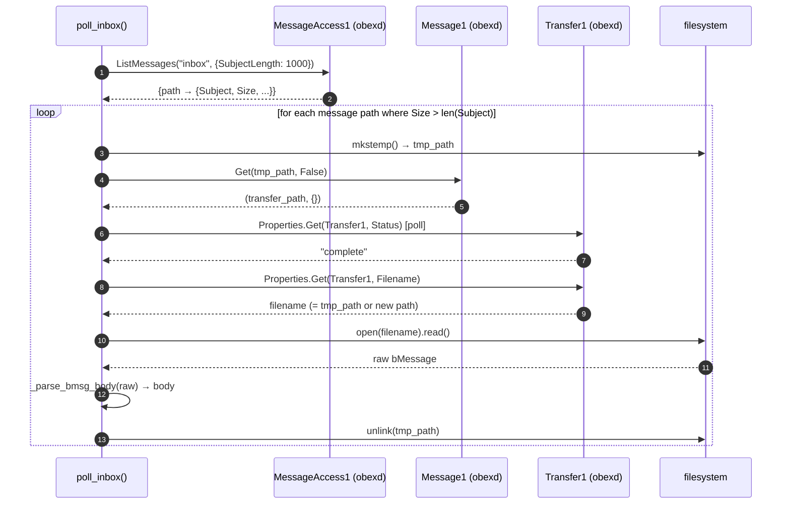

# Architecture: MAP Full-Body Retrieval (tincan-l8cik)

_Architect: tincan/architect · 2026-06-07_

---

## Problem Statement

`Message1.Get("", False)` — the only full-body retrieval path left after PR #46
replaced `MessageAccess1.GetMessage` — raises
`org.freedesktop.DBus.Error.UnknownObject` on 100% of calls (16/16 in the live
session). `poll_inbox()` falls back to the listing `Subject` field, which obexd
delivers as a 128-char preview. Bodies longer than 128 chars are truncated; the
user-visible symptom is a URL clipped mid-link (conv 898287, bug-1780850312).

---

## Requirements

| ID | Requirement |
|----|-------------|
| FR-1 | Full message body is retrieved for SMS/iMessage bodies longer than the Subject preview |
| FR-2 | Truncated-URL messages render fully; phone's visible text matches tincan's |
| FR-3 | Daemon log shows `Transfer recv` successes; no `Get failed … UnknownObject` |
| FR-4 | Regression test `test_BUG_message1_get_unknownobject_truncates_body_to_subject_preview` remains passing |
| FR-5 | A new unit test asserts the fixed retrieval path does NOT fall through to Subject |
| NFR-1 | No new third-party dependencies |
| NFR-2 | Backward compatible: if `Message1.Get(tmpfile)` also fails, Subject fallback is retained |
| NFR-3 | Fix verified on live hardware before bead closure (no mock-only proof) |

---

## Constraints

| Type | Constraint |
|------|-----------|
| Technical | `MessageAccess1.GetMessage` was removed in BlueZ 5.66+ — do NOT reintroduce |
| Technical | Both known retrieval paths fail on this hardware; fix must be diagnosed on live BlueZ |
| Process | MAP body retrieval changes must be live-accepted on real hardware before closing |
| Scope | Out of scope: Subject field used in conversation list preview (intentional, see `dbus_service.py:620`) |

---

## Root Cause Analysis

### The error text is a diagnostic key

```
org.freedesktop.DBus.Error.UnknownObject:
  Method "Get" with signature "ss" on interface
  "org.freedesktop.DBus.Properties" doesn't exist
```

The error NAME is `UnknownObject`; the error TEXT references `Properties.Get`
with `ss` (two strings). `org.freedesktop.DBus.Properties.Get(interface, property)`
IS `(ss)` — it is a different call from `org.bluez.obex.Message1.Get(targetfile,
attachment)` which is `(sb)`.

This is NOT a path-not-found error. It is obexd calling `Properties.Get` on some
internal transfer object that has not been created yet — because `targetfile=""`
instructs obexd to generate a temp file path, and the code that does so references
a `Transfer1.Filename` property on an object that doesn't exist yet at the time of
the call.

### Primary hypothesis (H1): `targetfile=""` triggers an internal obexd race

When `Message1.Get("", attachment)` is called with an empty `targetfile`, obexd is
expected to create a temp file internally and set `Transfer1.Filename` on the
resulting transfer. On this obexd build, the code path that generates the temp file
name calls `org.freedesktop.DBus.Properties.Get` on a transfer object before that
object exists, producing the exact error observed. 

The message objects themselves ARE registered (16 distinct paths from ListMessages
were tried); the failure is inside obexd's tempfile-generation logic, not in the
object lookup.

**Testable prediction:** passing a real (pre-created) file path to `Message1.Get`
bypasses obexd's temp-file logic and should succeed.

### Secondary hypothesis (H2): `Message1` interface absent on this obexd version

The message objects may expose only `org.freedesktop.DBus.Properties` (for
listing metadata) and NOT `org.bluez.obex.Message1`. The error text is then
obexd's response to an unknown interface.

**Distinguishing diagnostic (MANDATORY before writing the fix):**

```bash
# Step 1: start tincand with --backend mock or --backend map, let it do one poll
# Step 2: grab a message path from the daemon log
# Step 3: WHILE tincand is still running (session open):
busctl --user introspect org.bluez.obex /org/bluez/obex/client/session0/message<HANDLE>
```

If introspect shows `org.bluez.obex.Message1` with a `Get` method → H1 is likely.
If introspect shows only `org.freedesktop.DBus.Properties` (no `Message1`) → H2.
If the path doesn't exist at all → objects are ephemeral and a completely different
strategy is needed (file via session path).

The builder MUST run this diagnostic and record the result in the fix PR body.

---

## Selected Architecture: Tiered Retrieval with Live Diagnostic Gate

### Tier 1: `Message1.Get(tmpfile_path, attachment)` (primary fix)

Replace the current `targetfile=""` call with a caller-supplied temp file path:

```python
# In _fetch_raw_bmsg:
import tempfile

fd, tmp_path = tempfile.mkstemp(suffix=".bmsg")
os.close(fd)
try:
    result = self._retry(msg1.Get, tmp_path, dbus.Boolean(attachment))
    if result is None:
        return None
    transfer_path, _ = result
    # _wait_transfer_recv_raw reads Transfer1.Filename — which may equal tmp_path
    # or a different path obexd chose; handle both:
    return self._wait_transfer_recv_raw(str(transfer_path), fallback_path=tmp_path)
finally:
    try:
        os.unlink(tmp_path)
    except OSError:
        pass
```

`_wait_transfer_recv_raw` needs a `fallback_path` parameter: if
`Transfer1.Filename` is empty/unavailable, read from `fallback_path` directly.

### Tier 2: SubjectLength extension (stopgap, enable alongside Tier 1)

Change `ListMessages` options from `{}` to `{"SubjectLength": dbus.UInt16(1000)}`
in both inbox and sent calls. This increases the preview from ~128 to 1000 chars,
covering the majority of real SMS/iMessage bodies even if Tier 1 still fails.

**This is NOT a substitute for Tier 1.** It only reduces truncation severity for
the fallback path when full retrieval is unavailable.

### Tier 3: flag-and-skip (current behavior, retained)

When `Message1.Get` with tmpfile ALSO fails:
- Log `Get failed` (keep existing warning)
- Add `msg_path` to `_failed_handles`
- Fall through to `Subject` (existing fallback)
- No change in behavior for the total-failure case

### Where changes live

All changes are confined to `tincand/backends/bluez_map.py`:
- `_fetch_raw_bmsg` (lines 760-784): switch `targetfile` arg
- `_wait_transfer_recv_raw` (lines 791-816): add `fallback_path` parameter
- `poll_inbox` (lines 400, 453): add `SubjectLength` option to ListMessages opts

No changes to `tincan_gui/`, `tincand/dbus_service.py`, or the D-Bus contract.

---

## Data Flow



**Step 2:** If `Message1.Get(tmp_path)` raises `UnknownObject`, log warning,
add to `_failed_handles`, return `Subject` from step 1 (Tier 3 fallback).

---

## Verification Guardrail (new rule — embed in fix PR + AGENTS.md)

MAP body-retrieval changes CANNOT be closed on mocked-test success alone.
PR #46 went GREEN while the live path stayed broken. **Acceptance requires:**

1. **Regression mock** (automated): `test_BUG_message1_get_unknownobject_truncates_body_to_subject_preview` — simulates `Message1.Get` → `UnknownObject`, asserts body = truncated Subject. Must stay GREEN (proves the fallback path works correctly).

2. **Fix mock** (automated): new test `test_message1_get_tmpfile_fetches_full_body` — simulates `Message1.Get(tmpfile)` returning a transfer path whose `Transfer1.Filename` yields a full bMessage. Asserts body > Subject length.

3. **Live acceptance** (MANDATORY before closing):
   - Receive a real SMS > 128 chars containing a long URL on the operator's paired iPhone
   - Confirm the full body renders in tincan (no URL truncation)
   - `/tmp/tincand-*.log` shows `Transfer recv` lines (not `Get failed`)
   - Use the 🐞 File-a-Bug button if still broken; attach trace to the PR

The live acceptance step cannot be delegated to a mock. The builder must flag to the operator when the code is ready for live test.

---

## Risks

| Risk | Likelihood | Impact | Mitigation |
|------|-----------|--------|-----------|
| Tier 1 (tmpfile) also fails on live hardware | Medium | High | Builder runs busctl diagnostic first; may need to explore raw OBEX session path |
| `SubjectLength` option ignored by this obexd | Low | Medium | Verify option takes effect by checking Subject field length in daemon log |
| tmpfile left on disk if process crashes mid-Get | Low | Low | Tier 1 unlinks in finally; residual .bmsg files are harmless |
| Fix breaks FakeMapBackend mock | Low | Low | Update fake to accept and handle tmpfile arg |

---

## Guardrails for Builder

1. **Run busctl diagnostic FIRST** before writing any code. Record the interface list in the PR body.
2. **Do not reintroduce `MessageAccess1.GetMessage`** — removed in BlueZ 5.66+.
3. **Do not fake the live-test step.** If you cannot test on real hardware, flag `needs-live-test` on the bead and mail the operator.
4. **Do not bundle other fixes.** This bead is narrowly scoped to `_fetch_raw_bmsg` + `_wait_transfer_recv_raw` + SubjectLength option. Unrelated cleanup goes in a separate PR.
5. **Architecture principle (from operator, 2026-06-07):** The daemon (`tincand`) has NO MEMORY. Messages.db is an OBEX dedup ledger only; it is NOT conversation history. Body retrieval is fetch-on-poll; do not add persistent body storage to the daemon.

---

## Trade-offs & Alternatives Considered

| Alternative | Why not chosen |
|-------------|---------------|
| Re-extract handle from path and re-call `GetMessage(handle)` | `MessageAccess1.GetMessage` was removed in BlueZ 5.66+; would regress |
| GVFS/FUSE OBEX mount for body access | Requires GVFS obex backend, not reliable headlessly, fragile |
| Accept Subject-as-body permanently; raise SubjectLength to 1000 | Correct for most short messages but fails for long URLs; unacceptable for the primary use case |
| Use raw OBEX socket | Bypasses BlueZ; extreme complexity; would remove the D-Bus abstraction the whole backend rests on |

The tmpfile approach is the minimal-change fix that targets the exact failure
mode (empty-string targetfile) with the lowest blast radius.
