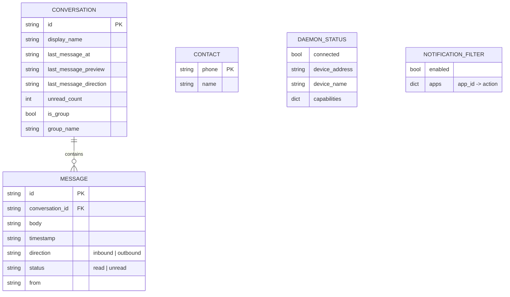
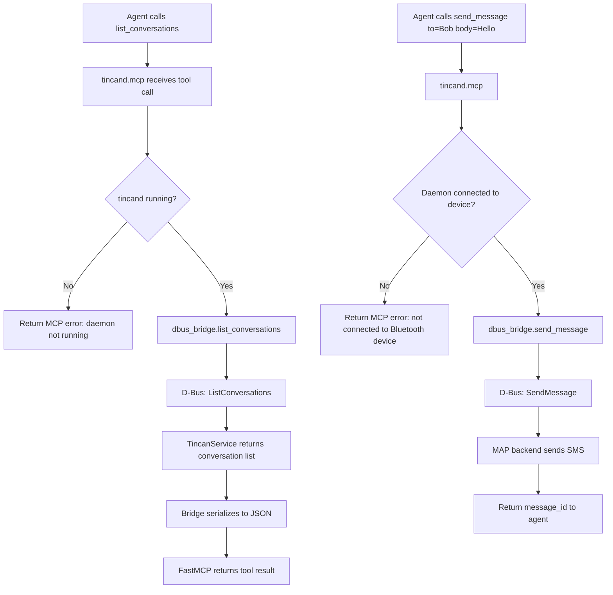
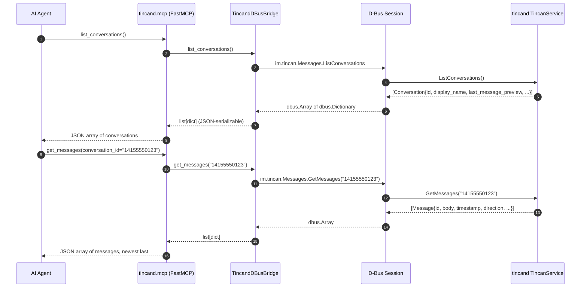
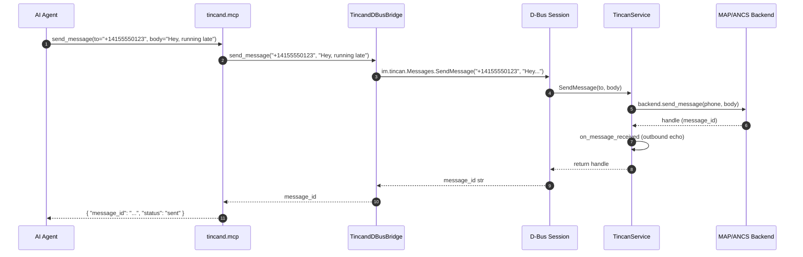

# Architecture: MCP Server API for Agents & Plugins (tincan-nq6v3)

## Problem Statement

tincan's capabilities (send/receive messages, list conversations, manage contacts,
filter notifications) are currently accessible only to the GUI via D-Bus and
QtDBus. There is no programmatic API for AI agents, automation scripts, or
third-party plugins to drive the daemon. An MCP server bridges this gap.

**Dependency note:** This feature benefits from `tincan-5ylqf` (Qt decoupling)
landing first — without it, `python -m tincand` fails without PySide6. The MCP
server itself has no Qt dependency; it talks to tincand over D-Bus. Testing the
MCP server headlessly requires the Qt decoupling fix.

---

## Requirements

| ID | Requirement |
|----|-------------|
| FR-1 | AI agents can list conversations and read messages over MCP |
| FR-2 | AI agents can send messages (SMS/iMessage) via MCP tools |
| FR-3 | AI agents can access the PBAP contacts list |
| FR-4 | AI agents can read and modify the notification filter |
| FR-5 | MCP server connects to a running tincand over D-Bus; it does not embed the daemon |
| FR-6 | MCP server is launchable as a stdio process (for Claude Code / LLM clients) |
| FR-7 | MCP server degrades gracefully when tincand is not running (returns error, does not crash) |
| NFR-1 | Zero dependency on PySide6 or any Qt library |
| NFR-2 | No changes required to tincand or tincan_gui to add the MCP server |
| NFR-3 | Entry point is `python -m tincand.mcp` |
| NFR-4 | SSE transport is optional (Phase 2); stdio is sufficient for Phase 1 |

---

## Constraints

| Type | Constraint |
|------|-----------|
| Technical | D-Bus session bus required (Linux desktop; same session as running tincand) |
| Technical | Python 3.10+; uses `dbus-python` (already in tincand) and `mcp` SDK |
| Technical | `tincan_gui/dbus_client.py` uses PySide6.QtDBus — not reusable here |
| Technical | tincand uses a GLib main loop; MCP SDK uses asyncio — event loop bridge required |
| Business | Read operations (list conversations, get messages) are informational; send operations carry real-world side effects — document clearly in tool descriptions |

---

## Technology Stack

| Layer | Choice | Version | Rationale |
|-------|--------|---------|-----------|
| MCP framework | `mcp` (FastMCP) | ≥1.0 | Official Python MCP SDK; decorator-based API; stdio transport built-in |
| D-Bus client | `dbus-python` | already in deps | Already used by tincand; no Qt; GLib integration included |
| Async bridge | `asyncio` + `threading.Thread` | stdlib | GLib loop runs in a daemon thread; signals forwarded to asyncio via `asyncio.Queue` |
| Entry point | `python -m tincand.mcp` | — | Sub-module in the existing tincand package |

**Why `dbus-python` over `dasbus`, `pydbus`?**
`dbus-python` is already a hard dependency of tincand. Introducing a different
D-Bus library (dasbus, pydbus) would add a new dep for no material benefit at
this scope. tincand already has the GLib/dbus integration working — the MCP
bridge reuses that pattern.

---

## Architecture Overview

```
+------------------+    stdio/SSE    +------------------+
|   AI Agent       | <~~~~~~~~~~~~> |  tincand.mcp     |
|   (Claude Code,  |   MCP protocol  |  MCP Server      |
|   Claude.ai,     |                 |  (new process)   |
|   etc.)          |                 +--------+---------+
+------------------+                          |
                                         D-Bus (Session Bus)
                                              |
                                    +---------+---------+
                                    |   tincand         |
                                    |   (existing       |
                                    |    daemon,        |
                                    |    unchanged)     |
                                    +-------------------+
```

**Process model:** `tincand.mcp` is a separate process that connects to the
running tincand as a D-Bus **client** — exactly as `tincan_gui` does, but without Qt.
The daemon is unchanged. The MCP server has no special privileges.

---

## Package Structure

```
tincand/
  mcp/
    __init__.py
    __main__.py          # python -m tincand.mcp entry point
    server.py            # FastMCP instance, tool/resource registrations
    dbus_bridge.py       # Qt-free D-Bus client (dbus-python)
    signal_relay.py      # GLib→asyncio bridge for D-Bus signals (Phase 2)
```

All files are in the existing `tincand` package — no new top-level package.

---

## D-Bus Bridge Design (`dbus_bridge.py`)

A thin synchronous wrapper around `dbus-python` that mirrors the D-Bus method
surface used by `TincanService`. No GLib main loop required for synchronous
method calls — only needed for signal subscription (Phase 2).

```python
class TincandDBusBridge:
    """Synchronous D-Bus client for tincand — no Qt dependency."""
    BUS_NAME = "im.tincan.Daemon"
    OBJECT   = "/im/tincan"
    IFACE_DAEMON   = "im.tincan.Daemon"
    IFACE_MESSAGES = "im.tincan.Messages"

    # Methods exposed:
    def get_status(self) -> dict: ...
    def list_conversations(self) -> list[dict]: ...
    def get_messages(self, conversation_id: str) -> list[dict]: ...
    def send_message(self, to: str, body: str) -> str: ...
    def send_group_message(self, recipients: list[str], body: str) -> str: ...
    def get_contacts(self) -> list[dict]: ...
    def mark_conversation_read(self, conversation_id: str) -> None: ...
    def get_notification_filter(self) -> dict: ...
    def set_notifications_enabled(self, enabled: bool) -> None: ...
    def set_app_filter(self, app_id: str, action: str) -> None: ...
    def get_seen_apps(self) -> list[dict]: ...
```

Error handling: if tincand is not running, `dbus.exceptions.DBusException` is
caught and re-raised as a structured MCP error (not a crash).

---

## MCP Tool Surface (Phase 1 — stdio MVP)

### Messaging tools

| Tool | D-Bus Method | Args | Returns |
|------|-------------|------|---------|
| `list_conversations` | `ListConversations` | — | `list[Conversation]` |
| `get_messages` | `GetMessages` | `conversation_id: str` | `list[Message]` |
| `send_message` | `SendMessage` | `to: str, body: str` | `message_id: str` |
| `send_group_message` | `SendMessageToRecipients` | `recipients: list[str], body: str` | `conversation_id: str` |
| `mark_conversation_read` | `MarkConversationRead` | `conversation_id: str` | `None` |
| `get_contacts` | `GetContacts` | — | `list[Contact]` |

### Daemon status tools

| Tool | D-Bus Method | Args | Returns |
|------|-------------|------|---------|
| `get_daemon_status` | `GetStatus` | — | `DaemonStatus` |

### Notification filter tools

| Tool | D-Bus Method | Args | Returns |
|------|-------------|------|---------|
| `get_notification_filter` | `GetNotificationFilter` | — | `NotificationFilter` |
| `set_notifications_enabled` | `SetNotificationsEnabled` | `enabled: bool` | `None` |
| `set_app_filter` | `SetAppFilter` | `app_id: str, action: "allow"\|"deny"` | `None` |
| `get_seen_apps` | `GetSeenApps` | — | `list[AppEntry]` |

**Tools intentionally omitted from Phase 1:**
- `Connect` / `Disconnect` — device connection management has side effects; defer
  to when use cases are clear. Agents should not arbitrarily disconnect.
- `FetchContactPhoto` — raw bytes not meaningful in MCP text context.

---

## MCP Resources (Phase 1)

Resources are read-only snapshots, fetched on demand (no push subscription in Phase 1).

| URI | Content | Backing Call |
|-----|---------|-------------|
| `tincan://status` | Daemon status (JSON) | `GetStatus` |
| `tincan://conversations` | All conversations (JSON) | `ListConversations` |
| `tincan://conversations/{id}/messages` | Messages for a conversation | `GetMessages` |
| `tincan://contacts` | All contacts (JSON) | `GetContacts` |

---

## Data Model — MCP Output Types



---

## Use Cases



---

## Sequence Diagrams

### Agent reads most recent message in a conversation



1. Agent calls `list_conversations` to discover available threads.
2. MCP server delegates to `TincandDBusBridge`.
3. Bridge makes a synchronous D-Bus method call.
4. `TincanService.ListConversations()` returns in-memory conversation list.
5–7. Result unmarshalled from D-Bus types to Python dicts.
8. FastMCP serializes to JSON and returns to the agent.
9. Agent identifies the conversation ID for the desired contact.
10–16. Agent calls `get_messages` to read the thread history.

### Agent sends a message



1. Agent calls `send_message` with recipient and body.
2. Bridge forwards to D-Bus synchronously.
3. `TincanService.SendMessage` resolves the phone number, calls the backend.
4. MAP backend transmits via Bluetooth.
5. Daemon creates an outbound echo message record.
6. Returns the message handle.
7–9. Bridge returns message_id to the MCP server.
10. FastMCP wraps in a tool result and returns to the agent.

---

## Event Loop Architecture

**Phase 1 (polling only):** Each tool call opens a D-Bus connection, calls the
method synchronously, and closes. No persistent connection, no GLib loop. Simple
and correct for request-response tool calls.

**Phase 2 (signal subscription):** For resource push (live conversation updates),
the MCP server needs to subscribe to D-Bus signals. This requires a GLib main
loop (dbus-python's signal mechanism). Architecture:

```
asyncio event loop (FastMCP)
        |
        | asyncio.Queue
        |
  GLib Thread ←── dbus signal callbacks
        |
    GLib.MainLoop.run()
```

A `signal_relay.py` module:
1. Spins up a daemon thread with its own `dbus.mainloop.glib.DBusGMainLoop` and `GLib.MainLoop`
2. Registers D-Bus signal handlers that call `asyncio.Queue.put_nowait()`
3. The asyncio main loop reads from the queue and pushes resource updates to MCP clients via SSE

Phase 2 is deferred — not required for Phase 1 stdio MVP.

---

## Security Controls

| Control | Detail |
|---------|--------|
| No authentication on stdio | stdio transport inherits the OS process user context; no separate auth needed |
| D-Bus session bus only | tincand binds to the session bus — accessible only to the same user session |
| Send message requires Bluetooth connection | `SendMessage` raises `im.tincan.Error.NotConnected` if daemon is not connected; this propagates as an MCP tool error |
| Tool descriptions warn on side effects | `send_message` and related write tools include explicit warnings in their MCP descriptions that they cause real-world actions |
| Secrets | None — MCP server does not handle credentials; device pairing is in the daemon |

---

## Integrations

| Integration | Direction | Protocol | Auth | Notes |
|------------|---------|---------|------|-------|
| tincand daemon | Client → Server | D-Bus session bus (dbus-python) | None (same user session) | Must be running before MCP server starts |
| LLM client (Claude Code) | Client → Server | stdio (MCP) | None (process context) | Standard MCP stdio transport |
| LLM client (Claude.ai) | Client → Server | SSE/HTTP (MCP) | TBD (Phase 2) | Optional; requires SSE transport |

---

## Risks

| Risk | Likelihood | Impact | Mitigation |
|------|-----------|--------|-----------|
| dbus-python version incompatibilities | Low | Medium | Pin to the version used by tincand; test in CI |
| Agent sends message to wrong recipient | Low | High | Tool description explicitly names the `to` arg; add a "confirm before send" MCP prompt template |
| D-Bus session not available (non-desktop env) | Medium | High for MCP; Low for daemon | Document that D-Bus session bus is required; fail fast with clear error |
| GLib/asyncio bridge deadlock (Phase 2) | Medium | Medium | Defer Phase 2; use `daemon=True` thread so GLib never blocks process exit |
| Tool result size: very long message lists | Low | Low | `get_messages` should accept optional `limit` and `since` args to cap response size |

---

## Alternatives Considered

| Approach | Why Not Selected |
|----------|----------------|
| Embed MCP server inside tincand (same process) | Would require mixing asyncio (MCP) and GLib (tincand) in the same process from the start; complicates daemon startup |
| REST/HTTP API instead of MCP | MCP is the standard for AI agent tool interfaces; REST is lower priority for agent use cases |
| Expose via Unix socket JSON-RPC | More work, no ecosystem benefit; MCP already standardizes JSON-RPC over stdio |
| Use pydbus/dasbus instead of dbus-python | dbus-python already a dependency; no benefit from adding another D-Bus library |

---

## Child Beads for Designer

Three implementation units:

1. **`tincand/mcp/dbus_bridge.py`** — Qt-free synchronous D-Bus client wrapping the existing TincanService API
2. **`tincand/mcp/server.py`** — FastMCP server with all Phase 1 tools and resources
3. **`tincand/mcp/__main__.py`** — entry point + packaging (pyproject.toml script entry)

The signal relay (`signal_relay.py`) is Phase 2 and should be filed separately when the Phase 1 MVP ships.

---

## Guardrails for Downstream Agents

- The MCP server is a **client** of tincand, not a replacement. It must never attempt to manage Bluetooth pairing, daemon lifecycle, or device state.
- `send_message` and `send_group_message` have real-world side effects. The tool descriptions MUST include this warning so LLM clients can present confirmation flows.
- `Connect`/`Disconnect` D-Bus methods are intentionally **not exposed** in Phase 1 — agents should not manage device connectivity.
- The `tincand.mcp` module MUST NOT import from `tincan_gui`. All D-Bus access goes through `tincand.mcp.dbus_bridge`.
