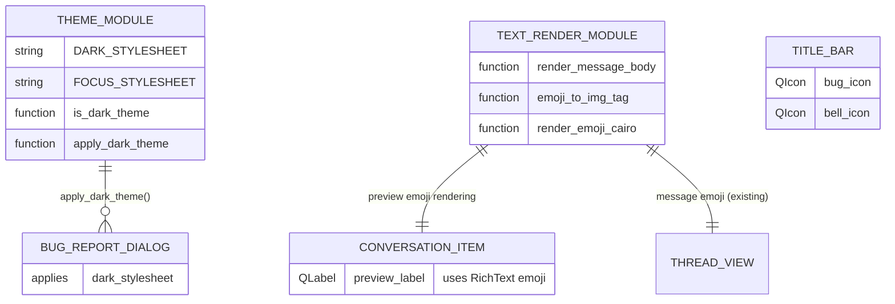
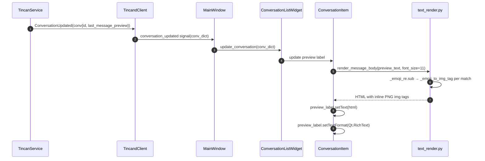

# Architecture: Emoji + Dark-Theme Consistency Pass (tincan-t8t9t)

## Problem Statement

Three UI inconsistencies surfaced during the 2026-06-07 bug pass:
1. **Title-bar emoji invisible** (`tincan-i87dn`): 🐞 and 🔔 buttons use emoji text
   that does not honor the stylesheet `color` → black-on-dark invisible.
2. **Conversation preview emoji blank** (`tincan-tcfs7`): emoji in the conversation
   list preview line doesn't render.
3. **File-a-Bug dialog unthemed**: dialog lacks dark stylesheet, appears with
   system-default light background in dark theme.

These are three symptoms of one root cause: **no single, consistent policy for
emoji rendering and dark-theme coverage**. The holistic pass defines that policy
so downstream builders apply it uniformly.

---

## Root Cause Analysis

### Emoji rendering in Qt/PySide6

Qt's QLabel font rendering has two emoji paths:

| Path | Trigger | Result |
|------|---------|--------|
| Text/symbol glyph | Unicode points < U+1F000 (e.g. ⚙ U+2699) | Honors stylesheet `color` |
| Emoji glyph | Emoji-range codepoints (🐞 U+1F41E, 🔔 U+1F514) | Paints in glyph's own color; **ignores** stylesheet `color` |
| Cairo+Pango renderer | `_render_emoji_cairo()` in `thread_view.py` | Full COLRv1 color emoji as inline PNG |

The message bubble path (thread_view.py) already uses the Cairo+Pango renderer
(`_emoji_to_img_tag`), producing inline PNG `` tags. This is the **ground
truth** for color emoji rendering in this project.

### Dark-theme coverage

`DARK_STYLESHEET` in `tincan_gui/theme.py` covers `QMainWindow`, `QScrollArea`,
`QListWidget`, `QPlainTextEdit`, `QLineEdit`. It does NOT cover:
- Custom dialogs that don't inherit from a styled parent
- Specifically: `BugReportDialog` (bug_report.py) and any new dialogs

---

## Requirements

| ID | Requirement |
|----|-------------|
| FR-1 | 🐞 and 🔔 title-bar buttons are clearly visible against `#0f4c3a` background |
| FR-2 | Emoji in conversation list preview labels render as color images |
| FR-3 | File-a-Bug dialog respects dark theme |
| FR-4 | Any new dialog added in the future receives the dark stylesheet automatically |
| NFR-1 | One consistent emoji rendering approach — no mixture of font-path + Cairo-path in the same text label |
| NFR-2 | Bugs tincan-i87dn and tincan-tcfs7 are superseded by this pass (no separate fix needed) |

---

## Framework Selections

| Layer | Choice | Rationale |
|-------|--------|-----------|
| Icon buttons (🐞, 🔔) | SVG icons via `QIcon` | SVG is recolorable via `QPainter` + tinting; immune to glyph rendering issues |
| Emoji in QLabel text | Cairo+Pango inline PNG (`_emoji_to_img_tag`) | Already proven in message bubbles; COLRv1-capable |
| Dark theme propagation | `setStyleSheet(DARK_STYLESHEET)` on `QDialog` base | Apply dark sheet in a shared dialog base class or in the app init |

---

## ONE Consistent Policy

### Rule 1 — Icon buttons: use QIcon/SVG, not emoji

Any button that uses an emoji character as its visible label MUST be replaced with
a proper `QIcon` backed by an SVG or raster asset tinted to the desired color via
`pixmap.fill()` / `pixmap.createMaskFromColor()` / `QIconEngine`.

**Affected:** `_bug_btn` (🐞), `_bell_btn` (🔔) in `main.py::TitleBar`.

The gear ⚙ button (U+2699) is a text/symbol glyph that works because it's in the
"Miscellaneous Technical" block, not the emoji block. It can stay.

**Asset approach:** Two SVG files (or one SVG with separate paths) for bug and
bell, stored in `tincan_gui/assets/` (or inlined as module-level strings). At
runtime, `QPixmap.fill(QColor("#ccfbf1"))` + mask produces a tinted icon in the
title-bar foreground color.

### Rule 2 — Emoji in QLabel text: always route through `_emoji_to_img_tag`

Any `QLabel` that may contain emoji characters must use `setTextFormat(Qt.RichText)`
and apply the same pipeline as message bubbles:
```
body_html = _render_message_body(text, font_size)
label.setText(body_html)
label.setTextFormat(Qt.RichText)
```

This applies to the conversation preview label (`ConversationItem`) in the
conversation list. The `_render_message_body` function (or the `_emoji_to_img_tag`
helper it calls) is currently in `thread_view.py` and should be extracted to a
shared utility module `tincan_gui/text_render.py` so the conversation list can
import it without creating a GUI circular dependency.

**Affected:** conversation preview label in `conversation_list.py::ConversationItem`.

### Rule 3 — Dark theme coverage: explicit `applyDark` helper

Create `tincan_gui/theme.py::apply_dark_theme(widget)` that:
1. Checks `is_dark_theme()`
2. If dark: calls `widget.setStyleSheet(DARK_STYLESHEET)` + any widget-specific
   dark overrides
3. Any `QDialog` or top-level `QWidget` that opens modally must call this helper
   in its `__init__`.

**Affected immediately:** `BugReportDialog` in `bug_report.py`.

**Future-proofing:** Add a project convention: every new dialog must call
`apply_dark_theme(self)` in its constructor. Document in `CLAUDE.md`/`AGENTS.md`
(maintainer's job, not this agent's).

---

## Data Model

No new persistent state. Purely a rendering/style change.



---

## Change Surface

| File | Change | Supersedes |
|------|--------|-----------|
| `tincan_gui/main.py` | Replace 🐞/🔔 emoji text buttons with `QIcon`-backed SVG buttons | tincan-i87dn |
| `tincan_gui/conversation_list.py` | Route preview label through emoji renderer | tincan-tcfs7 |
| `tincan_gui/theme.py` | Add `apply_dark_theme(widget)` helper | — |
| `tincan_gui/bug_report.py` | Call `apply_dark_theme(self)` in constructor | — |
| `tincan_gui/text_render.py` | NEW: extract `render_message_body` + `emoji_to_img_tag` + `render_emoji_cairo` from thread_view.py | — |
| `tincan_gui/assets/` | NEW: bug.svg, bell.svg (or inline QIcon data) | — |

**tincan-i87dn and tincan-tcfs7 are superseded by this holistic pass.** Builder
should coordinate: the point-fix beads routed to them should be deferred or
closed in favor of this consolidated work.

---

## Sequence: Emoji Rendering in Conversation Preview



1. Daemon emits `ConversationUpdated` with the new preview (which may contain emoji).
2–4. Signal routes to the relevant `ConversationItem`.
5. Preview text is passed to the shared `render_message_body()` function.
6. Emoji regex substitution replaces each emoji with a Cairo-rendered PNG `` tag.
7. HTML is returned.
8. The preview label displays HTML with inline color emoji images.
9. Label renders correctly regardless of system emoji font.

---

## Risks

| Risk | Likelihood | Impact | Mitigation |
|------|-----------|--------|-----------|
| Cairo+Pango unavailable in some installations | Low | Medium | `_render_emoji_cairo` already falls back to plain text on import failure |
| SVG assets require distribution | Low | Low | SVGs are small; inline them as Python string constants to avoid file path resolution issues |
| Performance: Cairo PNG rendering in conversation list is slower than font rendering | Low | Low | `_EMOJI_CACHE` in thread_view.py already memoizes renders; same cache applies after extraction |
| Extracting `text_render.py` may break existing thread_view.py imports | Low | Low | Keep re-exports in thread_view.py for backward compat |

---

## Child Beads for Designer

1. **Extract `tincan_gui/text_render.py`** — shared emoji renderer (extracted from thread_view.py)
2. **Fix title-bar icons** — replace 🐞/🔔 emoji buttons with SVG QIcon (supersedes tincan-i87dn)
3. **Fix conversation preview emoji** — route preview label through text_render (supersedes tincan-tcfs7)
4. **Add `apply_dark_theme()` + fix BugReportDialog** — dark theme helper + apply to missing dialogs
