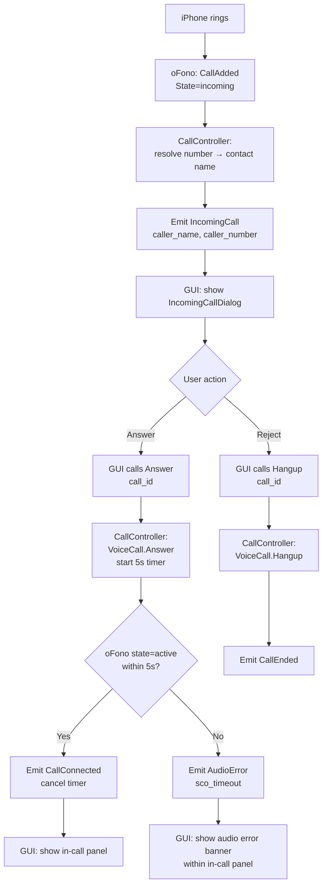
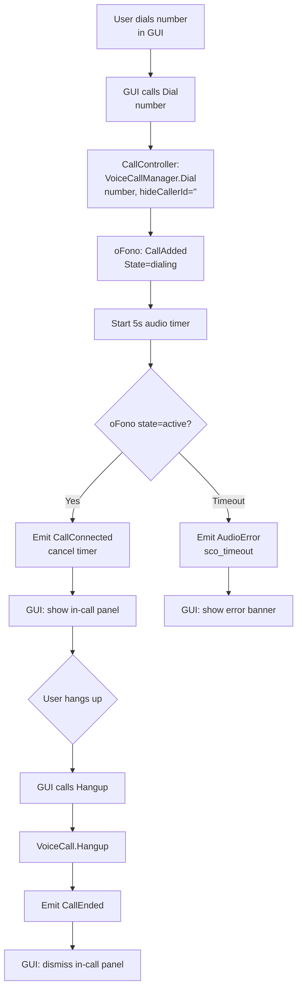
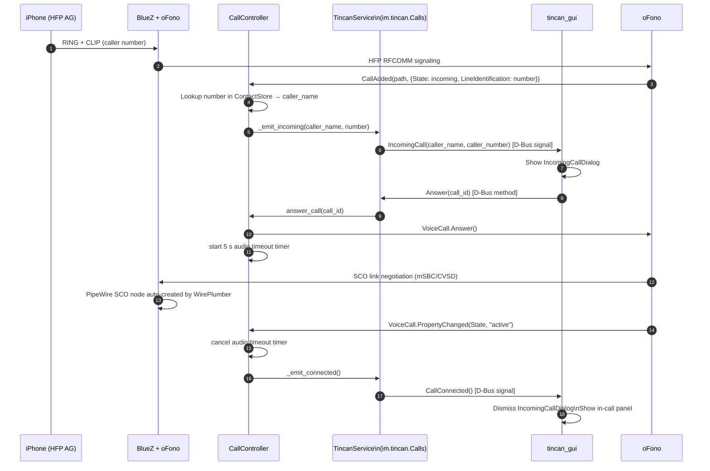

# Architecture: Phone Calls HFP + PipeWire — Finalized (tincan-xohrx)

_Architect: tincan/architect · 2026-06-07_  
_Supersedes framework: tincan-iaf2m (closed)_

---

## Status

**OQ-3 (MVP scope): ANSWERED** — Jim's direction (bd memory `tincan-calling-roadmap`):
Phase 1 = answer, hangup, dial + DTMF (SendTones). No hold/swap/multiparty in scope.

**OQ-1 (oFono packaging): DEFERRED** — packaging bead tincan-j9wvv explicitly
excluded oFono ("not yet a dependency"). When calls ship, tincan-j9wvv must be
amended to add oFono as an RPM/build dependency. File a packaging amendment bead
at handoff.

**Spike (tincan-xy2sb): STILL PENDING** — spike validates mSBC + oFono backend on
RTL8761B hardware. Builder MUST NOT start implementation until spike PASSES.
Architecture is complete now; implementation is gated on spike.

**Audio pre-validated:** PipeWire 1.6.4 bidirectional SCO audio confirmed working
with PipeWire-native HFP backend on 2026-06-05 (bd memory
`tincan-calling-hfp-os-audio-works`). oFono backend switch is the remaining
unknown. The hard part (audio routing) works; oFono call-control validation
is what the spike confirms.

---

## Requirements

| ID | Requirement |
|----|-------------|
| FR-1 | User can answer an incoming call from the tincan GUI |
| FR-2 | User can reject / hang up a call from the tincan GUI |
| FR-3 | User can dial an outgoing number from the tincan GUI |
| FR-4 | User can send DTMF tones during an active call (IVR navigation) |
| FR-5 | Incoming call shows caller name (from contacts) and number |
| FR-6 | GUI displays an error if call audio fails to establish within 5 s |
| NFR-1 | Call state transitions are visible in the GUI within 500 ms of oFono firing |
| NFR-2 | oFono modem discovery retries for 30 s after BT connect before giving up |
| NFR-3 | Daemon continues operating normally if no oFono is installed |

---

## Constraints

| Type | Constraint |
|------|-----------|
| Technical | oFono `hfp_hf_bluez5` plugin must be installed (not in Fedora repos) |
| Technical | WirePlumber must have `bluez5.hfphsp-backend = ofono` config |
| Technical | Only ONE HFP backend can own the RFCOMM channel — PipeWire native vs oFono, not both |
| Technical | iPhone MAC is `D0:6B:78:33:46:20` ("Malala") — oFono modem path contains this |
| Technical | GUI D-Bus signal stubs are already implemented (tincan-fx79v.3, closed) — daemon must match exactly |
| Business | Phase 1 only: dial, answer, hangup, DTMF. No hold, swap, multiparty |
| Business | Do NOT install oFono or switch WirePlumber backend without Jim present |

---

## Finalized D-Bus Interface: `im.tincan.Calls`

Bus name: `im.tincan.Daemon`  
Object path: `/im/tincan` (same object as existing TincanService)  
Interface: `im.tincan.Calls`

**These names are locked** — the GUI client (dbus_client.py) already subscribes
to exactly these signal names via QDBus. Do not rename.

### Methods (GUI → daemon)

| Method | Signature | Description |
|--------|-----------|-------------|
| `Dial` | `s number → s call_id` | Dial outgoing number. Returns oFono call path (short form) |
| `Answer` | `s call_id → ` | Answer the identified incoming call |
| `Hangup` | `s call_id → ` | Hang up a specific call |
| `SendDtmf` | `s key → ` | Send single DTMF digit (`0-9`, `*`, `#`) during active call |

`call_id` is the short form of the oFono VoiceCall object path, e.g.
`voicecall01`. Use it as a stable handle across state transitions.

### Signals (daemon → GUI)

| Signal | Signature | Description |
|--------|-----------|-------------|
| `IncomingCall` | `ss caller_name, caller_number` | New inbound call. `caller_name` empty string if not in contacts |
| `CallConnected` | ` ` | Call transitioned to `active` state |
| `CallEnded` | ` ` | Call terminated (for any reason) |
| `AudioError` | `s reason` | PipeWire SCO failed to establish. Known reasons: `sco_timeout`, `sco_setup_failed` |
| `AudioRestored` | ` ` | Audio recovered after an `AudioError` (e.g. headset reconnected mid-call) |

These match the exact D-Bus signal names the GUI subscribes to:
```python
# dbus_client.py — already wired:
b.connect(_BUS_NAME, _OBJECT, _IFACE_CALLS, "IncomingCall", ...)
b.connect(_BUS_NAME, _OBJECT, _IFACE_CALLS, "CallConnected", ...)
b.connect(_BUS_NAME, _OBJECT, _IFACE_CALLS, "CallEnded", ...)
b.connect(_BUS_NAME, _OBJECT, _IFACE_CALLS, "AudioError", ...)
b.connect(_BUS_NAME, _OBJECT, _IFACE_CALLS, "AudioRestored", ...)
```

---

## Module: `tincand/call_controller.py`

New daemon module. Registered via `TincanService` — similar pattern to how
`MessageStore` and `ContactStore` are injected into `TincanService`.

### Responsibilities

1. Connect to oFono on the **system** D-Bus (not session bus)
2. Discover the iPhone HFP modem object with retry
3. Subscribe to `org.ofono.VoiceCallManager` signals: `CallAdded`, `CallRemoved`
4. Subscribe to `org.ofono.VoiceCall.PropertyChanged` for each active call
5. Maintain an in-memory `_calls: dict[str, CallState]` dict
6. Translate oFono events → `im.tincan.Calls` D-Bus signals via `TincanService`
7. Expose call-control methods: translate GUI `Answer/Hangup/Dial/SendDtmf` →
   oFono `VoiceCall.Answer()`, `VoiceCall.Hangup()`, `VoiceCallManager.Dial()`,
   `VoiceCallManager.SendTones()`
8. Guard audio: start a 5 s timer on `Answer()`; emit `AudioError("sco_timeout")`
   if call does not reach state `active` within that window

### Call state enum

```
idle → incoming → active → terminated
idle → dialing  → active → terminated
active → held                          # Phase 2, ignored in Phase 1
```

### Graceful degradation (NFR-3)

If oFono is not installed or not running, `CallController` logs a warning at
startup and remains idle. All `im.tincan.Calls` methods return a D-Bus error
`org.freedesktop.DBus.Error.ServiceUnknown` with text
`"oFono not available — install oFono to use call features"`.

### Internal dataclass

```python
@dataclass
class CallState:
    call_id: str          # short path, e.g. "voicecall01"
    ofono_path: str       # full D-Bus object path
    state: str            # incoming | dialing | active | held | terminated
    number: str           # caller/callee number
    direction: str        # inbound | outbound
```

---

## Modem Discovery Retry Strategy

The iPhone HFP modem appears in oFono only AFTER the Bluetooth HFP connection
is fully established (RFCOMM channel open). This happens 1–3 s after
`bluetoothctl connect` or after the phone comes into range. The controller
must not assume the modem exists at startup.

### Algorithm

```
1. At CallController.__init__:
   a. Subscribe to org.ofono.Manager.ModemAdded / ModemRemoved (system bus)
   b. Call GetModems() immediately
   c. If HFP modem found → bind to it (goto "bound")
   d. If not found → start retry timer

2. Retry timer: exponential backoff 1s, 2s, 4s, 8s, 15s (cap); stop at 30s total
   On each tick: call GetModems(); if HFP modem found → stop timer, bind

3. On ModemAdded signal: check if new modem is type=hfp + iPhone MAC → bind

4. On ModemRemoved signal: if currently bound modem is removed →
   clear call state, emit CallEnded for any active call, enter unbound state,
   start retry timer again (iPhone may reconnect)

5. "bound" state: hold the interface proxy for
   org.ofono.VoiceCallManager on the HFP modem; subscribe to
   VoiceCallManager.CallAdded and VoiceCallManager.CallRemoved
```

**HFP modem identification:** filter modems where `Type == "hfp"` AND
object path contains the iPhone MAC (`d0_6b_78_33_46_20` with underscores,
as oFono encodes MACs in paths).

---

## PipeWire Audio Error Handling

PipeWire manages SCO audio autonomously once oFono establishes the call.
`CallController` does NOT interact with PipeWire directly. Instead it uses
oFono call state as the proxy for audio readiness:

- When `Answer()` is called: start a `GLib.timeout_add(5000, _on_audio_timeout)` timer
- When oFono fires `VoiceCall.PropertyChanged(State, "active")`: cancel the timer,
  emit `CallConnected()`
- If `_on_audio_timeout` fires before state=active: emit `AudioError("sco_timeout")`
  and leave the call in its current oFono state (call may still be "dialing"/"held")

**AudioRestored:** If a call is in error state but subsequently transitions to
`active` (e.g. audio recovers), emit `AudioRestored()`. This happens if
WirePlumber re-establishes the SCO link while the RFCOMM control is still up.

**Note for spike (tincan-xy2sb):** The spike will validate whether the 5 s
timeout is appropriate, or if it needs tuning. It will also validate that
switching WirePlumber to `bluez5.hfphsp-backend = ofono` does not break
existing MAP sessions (they use Classic RFCOMM/OBEX, not affected by HFP backend).

---

## Layer Diagram

```
+-------------------+    D-Bus (session)  +---------------------------+
|   tincan_gui      | <~~~~~~~~~~~~~~~~~~> |   tincand                 |
|   IncomingCall-   |   im.tincan.Calls:   |   TincanService           |
|   Dialog          |   IncomingCall(ss)   |     + im.tincan.Calls     |
|   CallWidget      |   CallConnected()    |       (new interface)     |
|   DtmfKeypad      |   CallEnded()        |                           |
|   (new UI)        |   AudioError(s)      |   CallController          |
|                   |   AudioRestored()    |     (new module)          |
|                   |                      |       ↕ system bus        |
+-------------------+   Answer(s)  ←──── |   org.ofono               |
                        Hangup(s)  ←──── |   hfp_hf_bluez5           |
                        Dial(s)    ←──── |   VoiceCallManager        |
                        SendDtmf(s)←──── |   VoiceCall               |
                                          +------------+--------------+
                                                       |
                                          +------------+--------------+
                                          |   BlueZ + PipeWire        |
                                          |   SCO audio (auto)        |
                                          +-----------+---------------+
                                                      |
                                                 iPhone (HFP AG)
```

---

## Use Case: Incoming Call



---

## Use Case: Outgoing Call



---

## Sequence: Incoming Call (detailed)



1. iPhone initiates an incoming call over the HFP RFCOMM channel.
2. BlueZ/oFono exchanges AT commands and surfaces the call via D-Bus.
3. oFono fires `CallAdded` on `VoiceCallManager` with state=`incoming`.
4. `CallController` looks up the caller number in `ContactStore` for a display name.
5. Calls `TincanService._emit_incoming()` to fire the D-Bus signal.
6. `TincanService` emits `im.tincan.Calls.IncomingCall` on the session bus.
7. `tincan_gui` receives the signal via its QDBus subscription and shows the dialog.
8. User clicks "Answer" — GUI calls `im.tincan.Calls.Answer(call_id)`.
9. `TincanService` dispatches to `CallController.answer_call(call_id)`.
10. `CallController` calls `VoiceCall.Answer()` on the oFono system bus.
11. A 5 s audio timeout timer is started to guard SCO establishment.
12. oFono + BlueZ negotiate SCO link (mSBC preferred, CVSD fallback).
13. WirePlumber (configured `bluez5.hfphsp-backend = ofono`) auto-creates the PipeWire SCO audio node.
14. oFono fires `PropertyChanged(State, "active")` on the VoiceCall object.
15. `CallController` cancels the 5 s timer.
16. Emits `CallConnected()` via `TincanService`.
17. GUI dismisses the dialog and shows the in-call panel with DTMF keypad.

---

## Security Controls

| Control | Detail |
|---------|--------|
| Session bus only | `im.tincan.Calls` is on the session bus — only processes running as the user can call it |
| No raw AT commands | GUI never speaks to oFono directly; all AT/HFP AT commands go through tincand |
| DTMF validation | `SendDtmf` validates key is a single char in `[0-9*#]`; rejects anything else with D-Bus error |
| No call forwarding | `CallController` must not implement `Deflect` or forward audio between devices |

---

## Integrations

| System | Direction | Protocol | Notes |
|--------|-----------|----------|-------|
| oFono | tincand → oFono | D-Bus system bus (`org.ofono`) | oFono must be running as root / system service |
| PipeWire | implicit | PipeWire session (managed by WirePlumber) | No direct API; WirePlumber creates SCO node when call goes active with ofono backend |
| ContactStore | internal | Python method call | Used to resolve caller number → display name |
| BlueZ | via oFono | BlueZ manages RFCOMM/SCO; oFono is client | No direct BlueZ calls from tincand for calls |

---

## Risks

| Risk | Likelihood | Impact | Mitigation |
|------|-----------|--------|-----------|
| **SCO unstable on RTL8761B (unvalidated)** | Unknown | High | Spike tincan-xy2sb MUST pass before builder starts |
| **oFono + WirePlumber backend switch breaks MAP audio** | Low | High | MAP uses Classic RFCOMM/OBEX; MAP is unaffected by HFP backend. Verify in spike. |
| **oFono modem discovery race** | Medium | Medium | Retry strategy (exponential, 30 s total) covers it |
| **mSBC not negotiated (falls back to CVSD)** | Medium | Low | Acceptable; audio works, just narrowband. Log codec for diagnostics. |
| **oFono packaging on Fedora** | High | High | tincan-j9wvv needs amendment; COPR or source build |
| **iPhone lands on A2DP-only, no HFP** | Low | High | Force `hands-free` via WirePlumber profile config if needed |
| **Audio timeout too short** | Unknown | Medium | Spike should measure actual SCO setup time; 5 s may need tuning |

---

## Trade-offs & Alternatives Considered

**Alternative: PipeWire-native backend (no oFono)**  
PipeWire's native HFP backend gives audio. Call CONTROL (answer, hangup, DTMF)
requires raw BlueZ socket work or a thin AT-command library. Much more code,
less tested path, no D-Bus API to model against. oFono gives a clean D-Bus
VoiceCallManager API that maps directly to our use case. **oFono chosen.**

**Alternative: libphonenumber / full VoIP stack**  
overkill. We own one phone, one user. oFono is the right tool.

**Alternative: Rich multi-call D-Bus API (GetCalls, hold, swap)**  
Proposed in tincan-iaf2m. Deferred — Jim's Phase 1 scope doesn't include it.
The interface can be extended in Phase 2. Keeping Phase 1 lean avoids
over-engineering a feature that may evolve once the spike is done.

---

## Guardrails

- `CallController` must NOT bridge calls between two phones or forward audio.
- `SendDtmf` must validate the key is exactly one character in `[0-9*#]`.
- If SCO audio fails to establish within 5 s of `Answer()`, emit
  `AudioError("sco_timeout")`. Never show a "connected" in-call panel with no
  audio silently.
- oFono is accessed on the SYSTEM D-Bus, not the session bus. tincand must use
  `dbus.SystemBus()` for all oFono calls.
- If oFono is absent: log a single WARNING and degrade gracefully (no crash,
  no busy-loop retry, just idle).
- WirePlumber config file `~/.config/wireplumber/bluetooth.lua.d/50-hfp-ofono.lua`
  must be documented as a prerequisite for call audio. The daemon should surface
  this as a capability flag if oFono is present but WirePlumber is not configured.

---

## Packaging Note (OQ-1 deferred)

`tincan-j9wvv` (closed) explicitly excluded oFono from the RPM spec.
A packaging amendment bead must be filed when calls are ready to ship.
oFono is not in Fedora repos as of 2026-06; options:
- COPR (preferred if a reliable COPR exists)
- Bundle the oFono binary in tincan's COPR spec
- Document `make install` from source as a user prereq

The spike (tincan-xy2sb) must record which method was used — that becomes the
documented install path.

---

## Design Handoff Checklist

The following design beads should be created from this architecture:

**Bead A — `tincand/call_controller.py` + `im.tincan.Calls` service**
- Implement `CallController` class per spec above
- Add `im.tincan.Calls` interface to `TincanService`
- Wire `CallController` into daemon startup (`__main__.py` or `backend_manager.py`)
- Follow existing pattern: constructor receives `bus` + `contact_store`; registered
  as `self._call_controller = CallController(bus, contact_store)` in TincanService

**Bead B — `tincan_gui` call UI**
- `IncomingCallDialog`: non-blocking dialog; answer + decline buttons;
  auto-dismisses on `CallEnded`; displays caller name + number from `IncomingCall` signal
- In-call panel: shows when `CallConnected` fires; caller name, call timer,
  hangup button, DTMF keypad (12 keys, 0–9 + * + #, each presses `send_dtmf(key)`)
- Audio error banner: shown in in-call panel when `AudioError` fires;
  text "Audio unavailable — check Bluetooth connection"; dismissed on `AudioRestored`
- See existing `tincan-fx79v.2` (MainWindow QStackedWidget state machine) —
  that bead is now unblocked by this architecture
