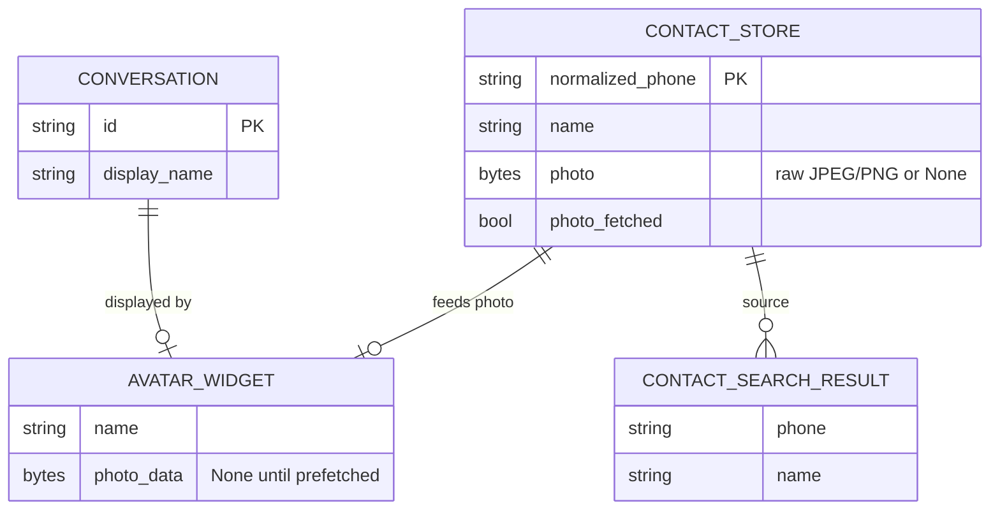
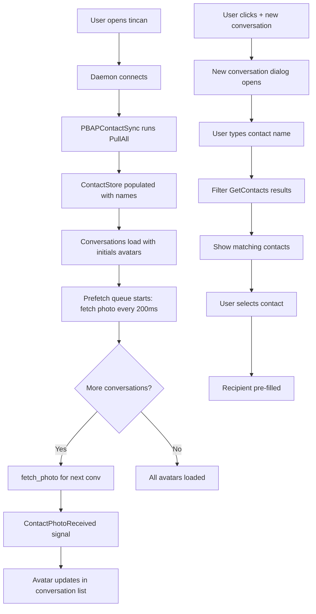
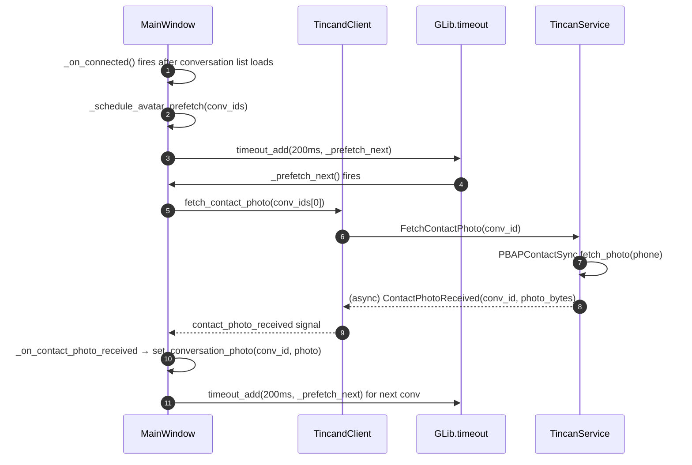

# Architecture: Contacts — Avatars & Search (PBAP, tincan-yg4t8)

## Current State Assessment

Before designing, architect surveyed the existing implementation:

| Feature | Status | Location |
|---------|--------|----------|
| Bulk name sync (PBAP PullAll → vCards → display names) | ✅ Done | `tincand/backends/pbap.py::PBAPContactSync.connect()` |
| On-demand photo fetch (PBAP Pull per contact) | ✅ Done | `pbap.py::PBAPContactSync.fetch_photo()` |
| Thread header avatar (shows photo or initials on conversation open) | ✅ Done | `tincan_gui/thread_view.py::ThreadHeaderBar`, `tincan_gui/avatar.py` |
| Avatar widget (40px circle, photo or deterministic initials fallback) | ✅ Done | `tincan_gui/avatar.py::AvatarWidget`, `GroupAvatarWidget` |
| Avatar in conversation list item (shows initials, updates when photo arrives) | ✅ Done | `tincan_gui/conversation_list.py::ConversationItem`, `set_conversation_photo()` |
| Conversation list text filter (filter by name/number) | ✅ Done | `tincan_gui/conversation_list.py::_SearchLineEdit` |
| Photo routing (ContactPhotoReceived D-Bus signal → GUI) | ✅ Done | `tincan_gui/dbus_client.py`, `tincan_gui/main.py:956` |
| Photo fetch trigger | ⚠️ On-demand only | `tincan_gui/main.py:742` — triggered on conversation select |
| PBAP contact directory search | ❌ Not done | — no search across full PBAP phonebook |
| Avatar prefetch for visible conversations | ❌ Not done | Initials shown until each conversation is clicked |

**What "in progress" means in the README:** avatars show initials in the
conversation list until the user clicks each conversation (triggering an on-demand
photo fetch). The full PBAP contact directory (contacts not yet in a conversation)
is not searchable.

---

## Requirements

| ID | Requirement |
|----|-------------|
| FR-1 | Conversation list avatars pre-populate with PBAP photos without requiring the user to click each conversation |
| FR-2 | Avatars load progressively (not blocking UI; not all at once) |
| FR-3 | Users can search the full PBAP contact directory, not just existing conversations |
| FR-4 | Contact search results can be tapped to start a new conversation |
| NFR-1 | Photo prefetch must not overwhelm the OBEX session (throttled) |
| NFR-2 | Contact directory search must not require a PBAP re-download (use existing name data) |

---

## Constraints

| Type | Constraint |
|------|-----------|
| Technical | PBAP session is a single OBEX connection — concurrent fetch_photo calls may serialize on device |
| Technical | Photo bytes are raw JPEG/PNG, potentially large per contact |
| Business | Photos are available only while Bluetooth is connected; must degrade gracefully when disconnected |

---

## Design

### Part A: Proactive Avatar Prefetch

**Problem:** `fetch_contact_photo(conv_id)` is currently called only from
`_on_conversation_selected` (main.py:742). The conversation list shows initials
until each conversation is individually clicked.

**Solution:** After `Connected` and initial conversation list load, batch-prefetch
photos for all conversations in the list, throttled to avoid OBEX overload.

**Architecture:**

```
MainWindow._on_connected()
    └── _schedule_avatar_prefetch()
           └── asyncio.gather / GLib.idle_add queue
                  └── for each conv in conversations:
                         _dbus_client.fetch_contact_photo(conv_id)
                         wait 200ms between calls (throttle)
```

**Throttle strategy:** Use `GLib.timeout_add(200, next_fetch)` — fire `fetch_photo`
every 200ms per conversation. This means 50 conversations take ~10 seconds total to
prefetch, with no OBEX burst. The GLib approach reuses the existing event loop.

**Implementation locus:** `tincan_gui/main.py::_on_connected()` — add a prefetch
queue after the initial conversation list is loaded. The `fetch_contact_photo`
D-Bus call and `ContactPhotoReceived` signal routing are already wired; only the
scheduling is new.

**Photo cache:** Photos are already cached in `ContactStore.photo` (in-memory,
`photo_fetched` flag prevents re-fetch). On reconnect, the in-memory cache is
cleared (`ContactStore.clear()`), so photos re-fetch. This is correct behavior.

### Part B: PBAP Contact Directory Search

**Problem:** The conversation list filter only searches existing conversations.
If a user wants to message someone who hasn't messaged them yet, they must know
the phone number — there's no way to search the PBAP contact book.

**Solution:** A contact directory search panel accessible from the new-conversation
dialog, backed by the `ContactStore` that's already populated by PBAP.

**Two options considered:**

| Option | Description | Trade-off |
|--------|-------------|-----------|
| A: Extend existing compose dialog | Add a "Contacts" tab to the new-conversation `QDialog` that searches `GetContacts()` | Simpler; reuses existing dialog |
| B: Dedicated search widget in conversation list header | A second search mode (toggle) that searches contacts, not just conversations | More discoverable; aligns with Messages.app UX |

**Recommendation: Option A** — extend the new-conversation dialog. The compose
panel already has autocomplete for entered numbers. Extending it to show PBAP
contacts is lower risk and lower UI surface change. Option B can follow in a
polish pass.

**Architecture for Option A:**

```
New-conversation dialog:
  [Search contacts…] QLineEdit
  QListWidget (results)
    ← populated by GetContacts() filtered by query
  [Message] button → pre-fills recipient

tincan_gui/dbus_client.py:
  get_contacts() → list[dict]   (already exists in TincandClient)
  
tincan_gui/main.py (new-conversation dialog):
  On search text changed:
    1. Query GetContacts() (cached; re-fetch if stale)
    2. Filter by name prefix (case-insensitive)
    3. Show top 8 matches in QListWidget
    4. Clicking a result sets the recipient and closes the picker
```

The `GetContacts` D-Bus method already exists and returns `[{phone, name}]`.
The only new code is the search UI in the new-conversation flow.

---

## Data Model



---

## Use Cases



---

## Sequence: Proactive Avatar Prefetch



1. After `Connected` and initial conversation list load, MainWindow initiates the prefetch sequence.
2. A throttled queue (list of conv_ids) is set up.
3. GLib fires the first prefetch after 200ms.
4. `fetch_contact_photo` makes a non-blocking D-Bus call.
5. The daemon delegates to `PBAPContactSync.fetch_photo()`.
6. OBEX fetches the photo asynchronously.
7. The `ContactPhotoReceived` D-Bus signal fires.
8. The GUI routes it to `set_conversation_photo()`.
9. The avatar widget in the conversation list updates from initials to the photo.
10. The throttle timer fires the next prefetch.

---

## Security Controls

| Control | Detail |
|---------|--------|
| No sensitive data | PBAP photos are contact images; no credentials or PII beyond what the user's phone exposes |
| Photo size limit | `_make_photo_pixmap` already ignores malformed data (returns null QPixmap); existing guard is sufficient |

---

## Risks

| Risk | Likelihood | Impact | Mitigation |
|------|-----------|--------|-----------|
| OBEX session closes during prefetch burst | Low | Medium | 200ms throttle; `fetch_photo` already handles `DBusException` gracefully |
| Large contact list (500+ contacts) makes prefetch slow | Medium | Low | Only prefetch visible conversations (existing list), not all PBAP contacts |
| Photo fetch returns null for contacts without photos | Medium | None | `AvatarWidget.set_photo` already falls back to initials on null photo |

---

## Child Beads for Designer

1. **Proactive avatar prefetch** — throttled batch-fetch on connect
2. **Contact directory search in new-conversation dialog** — search GetContacts() + display picker
